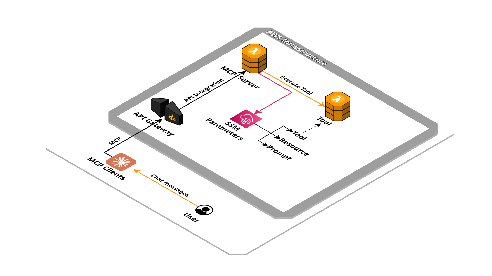

# Serverless MCP Framework


MCP Server implementation with AWS Serverless services.

## Created resources

A set of Lambda function connected to EventBridge rules that handle start, stop and task start. Create StepFunction state machine to wait until a specific date and send events.



## Installation

Using the [SAM CLI](https://docs.aws.amazon.com/serverless-application-model/latest/developerguide/what-is-sam.html):
```bash
sam build
sam deploy --guided
```

## Parameters

This application need some parameters when you deploy it:

- **EventBusName**: The event bus name to connect the integration to

- **Project**: Project identifier

- **Environment**: Environment identifier

- **ServerName**: The MCP server name

- **ServerVersion**: The MCP server version

- **Instructions**: The MCP server instructions

- **DomainName**: The domain name of the endpoint

- **AcmCertificateArn**: The certificate arn for the domain name provided

- **AuthenticationType**: Authentication type for the MCP server

- **OAuthIssuerUrl**: The issuer URL for OAuth authentication

- **OAuthAuthorizationUrl**: The authorization URL for OAuth authentication

- **OAuthTokenUrl**: The token URL for OAuth authentication

- **OAuthRevocationUrl**: The revocation URL for OAuth authentication

- **OAuthRedirectUris**: The redirect URIs for OAuth authentication

## Outputs

- **ServerEndpoint**: The MCP server endpoint

## Development

Requirements:
- [NodeJS](https://nodejs.org/en/download) >= 22.x

Install NPM modules
```bash
npm install
```

Configure the .env file with MCP server specifications:
```
SERVER_NAME=local
SERVER_VERSION=1.0.0
INSTRUCTIONS=""
```

Configure the .env file with AWS environment configuration:
```
AWS_PROFILE=<your AWS profile>
AWS_REGION=<selected AWS region>

SSM_PREFIX=
TOOLS_SSM_PREFIX=
RESOURCES_SSM_PREFIX=
PROMPTS_SSM_PREFIX=
TOOL_LAMBDA_PREFIX=
```

Run local MCP server
```bash
npm run dev
```

The MCP server is running on `http://localhost:3000/mcp`.

### Tool Inspector

Run the [MCP Inspector](https://github.com/modelcontextprotocol/inspector)
```bash
npm run inspector
```

Configure the inspector with:
- Transport Type: `Streamable HTTP`
- URL: `http://localhost:3000/mcp`

Connect to the MCP server with "Connect" button.

### Claude Desktop

Use [mcp-remote](https://www.npmjs.com/package/mcp-remote) to proxy HTTP to STDIO:
```json
{
  "mcpServers": {
    "example": {
      "command": "npx",
      "args": [
        "-y",
        "mcp-remote",
        "https://xxxxxxxxxx.execute-api.eu-west-1.amazonaws.com/dev/mcp",
        "--transport",
        "http-only"
      ]
    }
  }
}
```

## Deploy

Requirements:
- [SAM](https://docs.aws.amazon.com/serverless-application-model/latest/developerguide/install-sam-cli.html)
- [NodeJS](https://nodejs.org/en/download) >= 22.x

Build project
```bash
sam build
```

Deploy the stack
```bash
sam deploy --profile <your AWS profile> --guided
```

## Usage

Once the solution is installed, you can extend the MCP server with resources, prompts or tools using SSM parameters and Lambda functions.
The SSM parameters must begin with the prefix `/<project name>/<environment name>/`, for example `/mcp/dev/tools/echo`.

As an example of integration you can take inspiration from the template: [template.integration.yaml](./template.integration.yaml).

### Resources

The SSM parameters must begin with prefix `/<project name>/<environment name>/resources/`, for example `/mcp/dev/resources/example`.
The content must be in valid JSON format and have the properties:
- name: Resource name
- uri: Resource URI, for example "config://example"
- content: Resource text content

It can be declared in a SAM template as:
```yaml
ExampleResourceParameter:
  Type: AWS::SSM::Parameter
  Properties:
    Name: !Sub "/${Project}/${Environment}/resources/example"
    Type: String
    Value: |
      {
        "name": "example",
        "uri": "config://example",
        "content": "Just an example resource"
      }
```

### Prompts

The SSM parameters must begin with prefix `/<project name>/<environment name>/prompts/`, for example `/mcp/dev/prompts/echo`.
The content must be in valid JSON format and have the properties:
- name: Prompt name
- description: Prompt description
- inputSchema.json: [JSON schema](https://json-schema.org/)
- content: Prompt template content

The content template will be elaborate with [ejs](https://ejs.co/) with input data interpolation.

It can be declared in a SAM template as:
```yaml
EchoPromptParameter:
  Type: AWS::SSM::Parameter
  Properties:
    Name: !Sub "/${Project}/${Environment}/prompts/echo"
    Type: String
    Value: |
      {
        "name": "echo",
        "description": "Execute the example tool",
        "inputSchema": {
          "json": {
            "type": "object",
            "properties": {
              "message": {
                "type": "string"
              }
            },
            "required": ["message"]
          }
        },
        "content": "Execute the tool 'echo' with the message '<%= message %>'"
      }
```

### Tools

The SSM parameters must begin with prefix `/<project name>/<environment name>/tools/`, for example `/mcp/dev/tools/echo`.
The content must be in valid JSON format and have the properties:
- name: Prompt name
- description: Prompt description
- inputSchema.json: [JSON schema](https://json-schema.org/)

The related Lambda function that will be executed must be name as `<project name>-<environment name>-tools-<tool name>`, for example `mcp-dev-tools-echo`.
The function input and output must respect the [Converse API](https://docs.aws.amazon.com/bedrock/latest/userguide/tool-use-inference-call.html) pattern.

The parameter can be declared in a SAM template as:
```yaml
EchoToolParameter:
  Type: AWS::SSM::Parameter
  Properties:
    Name: !Sub "/${Project}/${Environment}/tools/echo"
    Type: String
    Value: |
      {
        "name": "echo",
        "description": "Print the message provided in input",
        "inputSchema": {
          "json": {
            "type": "object",
            "properties": {
              "message": {
                "type": "string"
              }
            },
            "required": ["message"]
          }
        }
      }
```

The Lambda function implementation could be:
```js
exports.handler = async ({ toolUseId, name, input }, context) => {
  return {
    name,
    toolUseId,
    status: 'success',
    content: [{
      text: input.message
    }]
  }
}
```
declared inline in a SAM template:
```yaml
EchoToolFunction:
  Type: AWS::Serverless::Function
  Properties:
    FunctionName: !Sub "${Project}-${Environment}-tools-echo"
    Handler: index.handler
    InlineCode: |
      exports.handler = async ({ toolUseId, name, input }, context) => {
        return {
          name,
          toolUseId,
          status: 'success',
          content: [{
            text: input.message
          }]
        }
      }
```

## Credits

- Repository badges by [Shields.io](https://shields.io/)
- Infrastructure schema by [Cloudcraft](https://www.cloudcraft.co/)
